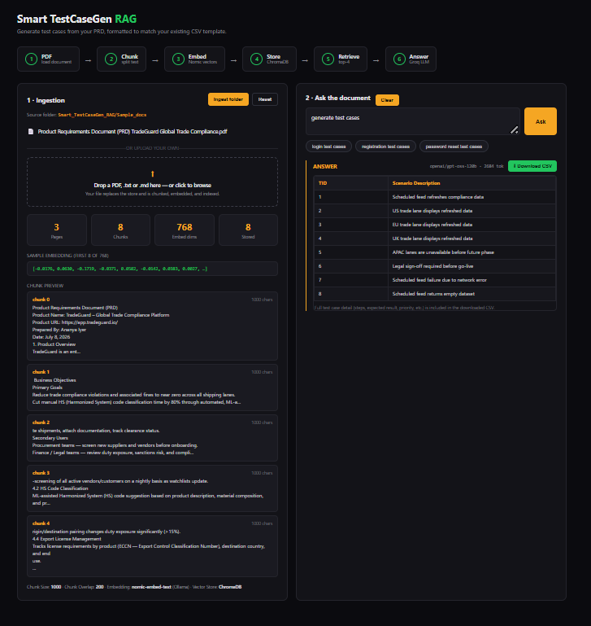
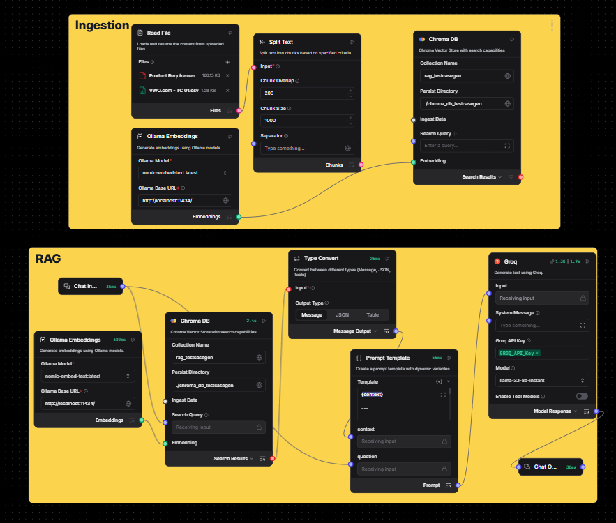

# Smart TestCaseGen RAG

> Upload a Product Requirements Document and get back QA test cases formatted to match your team's existing CSV template — or just ask questions about the document itself.

       

## What It Does

Upload a PRD (PDF, `.txt`, or `.md`) and ask for test cases — the app retrieves the relevant sections, then generates test cases via Groq's `openai/gpt-oss-120b`, orchestrated through a Langflow flow, and renders them as a table on screen with a "Ref:" citation back to the source PRD section for every row. No prompt engineering required: the retrieval, chunking, and generation behavior are all pre-configured in the Langflow flow file. Ask a non-test-case question instead ("what is this PRD about?") and the same flow answers in plain prose. Output is a live in-browser table plus a downloadable CSV that matches your team's existing test case template exactly.

## Architecture

```
 USER (browser)
   │
   ▼
 React / Vite frontend  (localhost:5181)
   │  fetch("/api/ask" | "/api/ingest/*")  — proxied to :4000
   ▼
 Express backend        (localhost:4000)
   │
   ├── POST /api/ask ─────────────► Langflow  /api/v1/run/{FLOW_ID}
   │                                 (localhost:7860)
   │                                     │
   │                                     ▼
   │                                 Groq LLM (openai/gpt-oss-120b)
   │                                     │
   │                                     ▼
   │                                 CSV test-case rows OR prose answer
   │
   └── POST /api/ingest/* ────────► backend/src/ingest.js
                                         │  parse PDF/txt/md → chunk (1000/200)
                                         ▼
                                     Ollama nomic-embed-text (localhost:11434)
                                         │  768-dim embeddings
                                         ▼
                                     backend/scripts/chroma_store.py
                                         │  (same store Langflow reads from)
                                         ▼
                                     ChromaDB  (collection: rag_testcasegen)
```

**Two separate ingestion paths write to the same ChromaDB store on purpose** — see [AI Integration](#ai-integration) for why.

| Service | Port | Started by |
|---|---|---|
| Frontend (Vite dev server) | `5181` | `npm run dev` in `frontend/` |
| Backend (Express) | `4000` | `npm start` in `backend/` |
| Langflow | `7860` | run separately (`langflow run` or Langflow desktop) |
| Ollama | `11434` | run separately (`ollama serve`) |

**Ingestion (offline, on upload/"Ingest folder")**: a PDF/txt/md file is parsed and chunked (1000 chars, 200 overlap) in the Node backend, embedded via Ollama's `nomic-embed-text` model (768 dimensions), and written directly into the ChromaDB collection `rag_testcasegen` through a small Python helper script, so the data lands in the exact same store Langflow's flow queries.

**Retrieval & generation (online, per question)**: the frontend posts a question to the backend, which calls Langflow's `/run` endpoint. Inside the flow, the question is embedded and used to similarity-search ChromaDB (top-21 chunks), the results are converted to plain text, and a dual-mode prompt template decides whether to answer in prose or generate CSV test case rows before calling Groq.

## AI Integration

**Orchestration layer — Langflow.** The retrieval + prompt + generation logic (chunk retrieval, the dual-mode system prompt, and the LLM call) all live inside a Langflow flow rather than hardcoded backend logic. This means the retrieval strategy, prompt wording, and even the LLM provider can be changed by editing the flow in Langflow's visual editor — no backend code changes or redeploys needed.

**LLM provider — Groq, model `openai/gpt-oss-120b`.** Selected inside the flow's Groq model node for free-tier access and fast inference; a smaller model (`llama-3.1-8b-instant`) was tried first but was unreliable at holding to the strict 11-column CSV format and often invented content unrelated to the retrieved PRD chunks. `openai/gpt-oss-120b` is the same model size class used in the reference architecture this project's UI is modeled on. To swap models, open the flow in Langflow and change the **Model Name** dropdown on the Groq node — no code change required.

**Exact AI call** — `backend/src/langflowClient.js:24`:
```js
const res = await fetch(`${BASE_URL}/api/v1/run/${FLOW_ID}?stream=false`, {
  method: "POST",
  headers: authHeaders({ "Content-Type": "application/json" }),
  body: JSON.stringify({
    output_type: "chat",
    input_type: "chat",
    input_value: question,
    session_id: sessionId,
  }),
});
```

**Session ID / context isolation.** Each browser tab generates a session ID once on load (`const SESSION_ID = \`web-${Date.now()}\`` in `AskPanel.jsx`) and reuses it for every question asked in that session. This keeps Langflow's internal chat memory scoped to one browser session so that one user's questions don't leak into another concurrent user's context.

**Where the prompt lives.** The system prompt is not a file in this repo — it's the **Template** field of the "Prompt Template" node inside the Langflow flow itself. It instructs the model to silently choose between two modes per question:
- **Test case generation mode** — triggered by questions like "login test cases". Forces exactly 11 comma-separated fields per row (matching the CSV template columns below), requires every field to be quoted, and requires a `Ref: <PRD section or requirement>` citation in the Misc (Comments) field so every generated row traces back to real PRD text (never an invented section name).
- **General question mode** — triggered by anything else (e.g. "what is this PRD about?"). Answers directly in prose/markdown using only the retrieved context, with no CSV output.

**Response parsing.** The raw Groq output is a single text blob. `frontend/src/csvDownload.js` runs a hand-written, quote-aware CSV parser (`parseCsvRecords`) across the *entire* answer text rather than splitting by line first — this matters because the model's "Steps to Execute" field legitimately contains embedded newlines inside quotes. A second pass, `reconcileFieldCount`, anchors on the `Ref:` marker to correctly realign columns whenever the model emits slightly more or fewer than 11 fields (a known small-model failure mode), rather than assuming the field count is always exact.

**Two ingestion paths, one store — why.** Langflow's own File-load component has an unresolved bug where it keeps serving stale, cached file content no matter what path is set on it via the API. Rather than depend on that broken node for re-ingestion, this project's backend (`ingest.js` + `scripts/chroma_store.py`) writes new documents directly into the same ChromaDB collection Langflow's retrieval node reads from, bypassing the broken node entirely. Langflow's ingestion chain (File → Split Text → Chroma) is still present in the flow for reference/manual use, but the web app's "Ingest folder" / drag-and-drop upload buttons go through the backend path.

**Output categories.** Every answer is one of exactly two shapes: an 11-column CSV test case table, or a markdown prose answer — `looksLikeCsv()` in `csvDownload.js` decides which by checking the first parsed record's field count and looking for a `TC_` / `TC-` pattern in the raw text.

## Prerequisites

| Requirement | Version | Notes |
|---|---|---|
| Node.js | 18+ | backend (Express 5) and frontend (Vite 8) |
| npm | 9+ | installs both `backend/` and `frontend/` dependencies |
| Python | 3.10+ | required by `backend/scripts/chroma_store.py`; must have `chromadb` installed (Langflow's own Python environment already includes it) |
| Langflow | 1.x | runs the retrieval + prompt + generation flow, `localhost:7860` by default |
| Ollama | latest | serves the `nomic-embed-text` embedding model locally, `localhost:11434` by default |
| Groq account | — | free-tier API key, used inside the Langflow flow's Groq model node |

## Installation

```bash
cd Smart_TestCaseGen_RAG

cd backend
npm install

cd ../frontend
npm install
```

## Configuration

Create `backend/.env` (copy the template below — never commit real values):

```env
LANGFLOW_BASE_URL=http://localhost:7860
LANGFLOW_API_KEY=<your-langflow-api-key>
FLOW_ID=<your-flow-id>

PORT=4000

OLLAMA_BASE_URL=http://localhost:11434
EMBED_MODEL=nomic-embed-text

CHROMA_PYTHON_BIN=<path-to-python-with-chromadb-installed>
CHROMA_PERSIST_DIR=<path-to-shared-chroma-persist-directory>
CHROMA_COLLECTION=rag_testcasegen

SAMPLE_DOCS_FOLDER=<path-to-Smart_TestCaseGen_RAG/Sample_docs>
```

| Variable | What it is | How to get the value |
|---|---|---|
| `LANGFLOW_BASE_URL` | Base URL of your running Langflow instance | Default `http://localhost:7860` if run locally |
| `LANGFLOW_API_KEY` | API key Langflow issues for programmatic access | Langflow UI → Settings → API Keys |
| `FLOW_ID` | UUID of the imported flow | Copy from the flow's URL in Langflow: `.../flow/<FLOW_ID>/...` |
| `PORT` | Port the Express backend listens on | Any free port; frontend's Vite proxy expects `4000` by default |
| `OLLAMA_BASE_URL` | Base URL of your local Ollama server | Default `http://localhost:11434` |
| `EMBED_MODEL` | Ollama embedding model name | Must match the model pulled via `ollama pull nomic-embed-text` |
| `CHROMA_PYTHON_BIN` | Path to a Python executable with `chromadb` installed | Point at Langflow's own venv Python, or any Python where `pip install chromadb` was run |
| `CHROMA_PERSIST_DIR` | Filesystem path ChromaDB persists to | **Must exactly match** the `Persist Directory` field on the Chroma DB nodes inside the Langflow flow |
| `CHROMA_COLLECTION` | ChromaDB collection name | **Must exactly match** the `Collection Name` field on the Chroma DB nodes inside the Langflow flow |
| `SAMPLE_DOCS_FOLDER` | Folder the "Ingest folder" button reads from | Defaults to this repo's `Sample_docs/` folder |

## AI Service Setup

1. **Install and start Langflow** (`pip install langflow` then `langflow run`, or use Langflow Desktop) so it's reachable at `http://localhost:7860`.
2. **Import the flow** — in Langflow, choose *Import*, then select `LangFlow_JSON_Smart_TestCaseGen_RAG.json` from this repo's root. Note: this exported file reflects an earlier AstraDB-based version of the flow; the current working setup uses ChromaDB instead (steps 3–5 below).
3. **Replace the AstraDB nodes with Chroma DB nodes** (two of them: one for ingestion, one for retrieval). On each Chroma DB node, set:
   - **Collection Name**: same value as `CHROMA_COLLECTION` in your `.env` (e.g. `rag_testcasegen`)
   - **Persist Directory**: same value as `CHROMA_PERSIST_DIR` in your `.env` (e.g. `./chroma_db_testcasegen`)
   - Wire an **Ollama Embeddings** component (model `nomic-embed-text`, base URL matching `OLLAMA_BASE_URL`) into each Chroma node's Embedding input.
4. **Set the retrieval node's Number of Results** (used as top-K chunk retrieval) — 21 is what this project uses.
5. **Add your Groq API key** on the Groq model node, and set **Model Name** to `openai/gpt-oss-120b`.
6. **Set the Prompt Template node's Template field** to the dual-mode prompt described in [AI Integration](#ai-integration) — it must instruct the model to emit exactly 11 quoted CSV fields per test case row (matching the columns in [Output Format](#output-format)) and a `Ref: <source>` citation in the Misc (Comments) field for test-case questions, or plain prose for everything else.
7. **Copy the Flow ID** from the flow's URL (`http://localhost:7860/flow/<FLOW_ID>/...`) into `FLOW_ID` in `backend/.env`.
8. **Pull the embedding model** locally: `ollama pull nomic-embed-text`, then confirm `ollama serve` is running.

## Running Locally

```bash
# terminal 1 — backend
cd backend
npm start
# → RAG explorer backend listening on http://localhost:4000

# terminal 2 — frontend
cd frontend
npm run dev
# → Local: http://localhost:5181/
```

Make sure Langflow (`:7860`) and Ollama (`:11434`) are already running before starting the backend. Open **http://localhost:5181** in a browser.

## Using the App

1. **Ingest a document** — either click **Ingest folder** to load everything in `Sample_docs/`, or drag a PDF/`.txt`/`.md` file into the drop zone (this replaces the current store).
2. **Review the ingestion stats** — page count, chunk count, embedding dimensions, and a live preview of the first few chunks and a sample embedding vector appear once ingestion completes.
3. **Ask a question** — type a request (e.g. "login test cases") or click one of the suggested chips, then click **Ask**.
4. **Review the answer** — test-case questions render as a two-column table (TID + Scenario Description) on screen; general questions render as formatted prose.
5. **Download the full CSV** — click **Download CSV** to get all 11 columns (including Steps to Execute, Expected Result, and the `Ref:` citation) formatted to match the uploaded template, with the TID column renumbered sequentially.
6. **Clear and repeat** — click **Clear** next to "Ask the document" to reset the question/answer state without reloading the page.


*The two-panel layout: Ingestion (left) with live chunk/embedding preview, and Ask the document (right) with the generated test case table and citation-backed answers.*


*The underlying Langflow flow: File load → Split Text → Ollama embeddings → Chroma DB for ingestion; Chat Input → Chroma retrieval → Type Convert → Prompt Template → Groq → Chat Output for generation.*

## Input Format

Supported upload types: **PDF**, `.txt`, `.md` (see `ACCEPTED_EXTENSIONS` in `frontend/src/components/IngestionPanel.jsx`). "Ingest folder" additionally accepts `.csv` files placed in `Sample_docs/`.

Real sample PRD used for testing — `Sample_docs/Product Requirements Document (PRD) VWO.com.pdf` — a standard PRD structure: Product Overview → Business Objectives → Target Users → Core Features → Non-Functional Requirements → Success Metrics. A second domain sample, `Sample_docs/Product Requirements Document (PRD) TradeGuard Global Trade Compliance.pdf`, follows the same structure for a different domain (global trade compliance) to verify the flow isn't hardcoded to one PRD's content.

**Tip:** test case quality (and citation accuracy) depends directly on how clearly the PRD is structured — numbered section headings (e.g. "4.2 HS Code Classification") let the model cite a specific `Ref:` source; PRDs without clear section headings still generate test cases but fall back to `Ref: general context`.

## Output Format

Real example row from `Downloaded-csv-testcases-samples/generated_test_cases.csv`:

```
TID,Scenario Description,Test Case ID,Pre Condition,Steps to Execute,Expected Result,Actual Result,Status,Executed QA Name,Misc (Comments),Priority
1,Scheduled feed refreshes compliance data,TC_01,System is deployed and scheduled feed is configured.,1. Wait for scheduled refresh time. 2. Observe system data.,Compliance data is refreshed successfully from provider.,,,,Ref: compliance data provider and refreshed via a scheduled feed,High
```

| Column | Meaning |
|---|---|
| TID | Sequential row number, reassigned by the frontend on every render/download regardless of what the model returned |
| Scenario Description | Short human-readable name for the test case |
| Test Case ID | Model-assigned ID following the `TC_XX` pattern, incrementing from the highest ID already present in the retrieved context |
| Pre Condition | State the system must be in before running the steps |
| Steps to Execute | Numbered steps, kept on a single line separated by spaces |
| Expected Result | What should happen if the steps pass |
| Actual Result | Always blank — filled in manually after execution |
| Status | Always blank — filled in manually after execution |
| Executed QA Name | Always blank — filled in manually after execution |
| Misc (Comments) | `Ref: <PRD section or requirement>` — traceability citation back to the source document |
| Priority | `High`, `Medium`, or `Low` |

## Sample Files

### Input Documents (`Sample_docs/`)

| File | Format | Covers |
|---|---|---|
| `Product Requirements Document (PRD) VWO.com.pdf` | PDF | VWO conversion-optimization platform PRD — login, dashboard, experimentation features |
| `Product Requirements Document (PRD) TradeGuard Global Trade Compliance.pdf` | PDF | Global trade compliance platform PRD — restricted-party screening, HS code classification, export licensing |

### Screenshots (`ScreenShots/`)

| File | Shows |
|---|---|
| `Smart_TestCaseGenerator_UI.png` | Full app UI: pipeline stepper, Ingestion panel (with live chunk/embedding preview), and Ask the document panel with a generated test case table |
| `LangFlow_Diagram.png` | The Langflow flow canvas: ingestion chain (File → Split Text → Ollama Embeddings → Chroma DB) and retrieval/generation chain (Chat Input → Chroma → Type Convert → Prompt Template → Groq → Chat Output) |

### Generated Output Samples (`Downloaded-csv-testcases-samples/`)

| File | Source input | Demonstrates |
|---|---|---|
| `TestCase_template-sample.csv` | — | The original uploaded template structure the app matches its CSV output to |
| `generated_test_cases.csv` | TradeGuard PRD, question "generate test cases" | Full downloaded output: 8 rows covering functional, negative, boundary, and edge cases, each with a `Ref:` citation |

## API Reference

```bash
curl -X POST http://localhost:4000/api/ask \
  -H "Content-Type: application/json" \
  -d '{"question": "login test cases", "sessionId": "web-12345"}'
```

Success response:
```json
{
  "answer": "1,\"Login with valid credentials\",TC_01,\"User is on the login page.\",\"1. Enter valid email. 2. Enter valid password. 3. Click submit.\",\"User is redirected to the dashboard.\",,,,\"Ref: 4.1 Restricted & Denied Party Screening\",High",
  "model": "openai/gpt-oss-120b",
  "usage": { "input_tokens": 918, "output_tokens": 548, "total_tokens": 1466 },
  "sources": []
}
```

Other endpoints (all under `http://localhost:4000`):

| Method | Path | Purpose |
|---|---|---|
| GET | `/api/health` | Backend + Langflow reachability check |
| GET | `/api/ingest/status` | Current ChromaDB store stats (chunk count, dims, sample embedding, chunk preview) |
| POST | `/api/ingest/folder` | Re-ingest every file in `SAMPLE_DOCS_FOLDER`, replacing the store |
| POST | `/api/ingest/upload` | Multipart file upload (`file` field); replaces the store |
| POST | `/api/ingest/reset` | Empties the ChromaDB collection |

## Project Structure

```
Smart_TestCaseGen_RAG/
├── backend/
│   ├── src/
│   │   ├── server.js            # Express app, all /api routes
│   │   ├── langflowClient.js    # calls Langflow's /run endpoint, parses the response
│   │   └── ingest.js            # PDF/txt/md parsing, chunking, Ollama embedding calls
│   ├── scripts/
│   │   └── chroma_store.py      # direct ChromaDB read/write (ingest/reset/status), shared with Langflow's store
│   └── .env                     # local secrets/config (not committed)
├── frontend/
│   └── src/
│       ├── App.jsx               # top-level layout: stepper + two panels
│       ├── api.js                # fetch wrappers for every backend endpoint
│       ├── csvDownload.js        # CSV parsing, column reconciliation, download logic
│       └── components/
│           ├── PipelineStepper.jsx    # 6-step pipeline visual (PDF→Chunk→Embed→Store→Retrieve→Answer)
│           ├── IngestionPanel.jsx     # upload/drop zone, ingest folder/reset, stats, chunk preview
│           └── AskPanel.jsx           # question input, answer table/prose rendering, CSV download
├── Sample_docs/                  # sample PRDs used for ingestion/testing
├── TestCase_template/            # the CSV template the app's output format matches
├── Downloaded-csv-testcases-samples/  # example downloaded output
├── ScreenShots/                  # UI + Langflow diagram screenshots referenced in this README
└── LangFlow_JSON_Smart_TestCaseGen_RAG.json  # exported flow (structural reference; see AI Service Setup)
```

## Team Adoption Checklist

- [ ] Install Node.js 18+, Python 3.10+, and confirm `npm -v` / `python --version` both work
- [ ] Install and start Ollama, then run `ollama pull nomic-embed-text`
- [ ] Install and start Langflow (`langflow run`), confirm `http://localhost:7860` loads
- [ ] Import `LangFlow_JSON_Smart_TestCaseGen_RAG.json` and follow [AI Service Setup](#ai-service-setup) to configure Chroma DB nodes, the Groq model, and the prompt template
- [ ] Create a Groq account and generate a free API key, paste it into the Groq node in Langflow
- [ ] Copy the Flow ID from the Langflow URL into `backend/.env`
- [ ] Run `npm install` in both `backend/` and `frontend/`
- [ ] Fill in `backend/.env` using the [Configuration](#configuration) table
- [ ] Start the backend (`npm start` in `backend/`) and confirm `http://localhost:4000/api/health` returns `{"ok":true,"langflow":true}`
- [ ] Start the frontend (`npm run dev` in `frontend/`) and open `http://localhost:5181`
- [ ] Click **Ingest folder** and confirm the stats grid populates (non-zero Pages/Chunks/Stored)
- [ ] Ask "login test cases" (or any suggested chip) and confirm a table renders with a working **Download CSV** button

## Troubleshooting

**`{"ok":false,"error":"..."}` from `/api/health`**
Cause: Langflow isn't running or isn't reachable at `LANGFLOW_BASE_URL`.
Fix:
1. Confirm Langflow is running: open `http://localhost:7860` in a browser.
2. Check `LANGFLOW_BASE_URL` in `backend/.env` matches the actual host/port.
3. Restart the backend after changing `.env`.

**`question is required` (400) from `/api/ask`**
Cause: the request body was missing or the `question` field was empty/whitespace — see the guard in `server.js:28`.
Fix: ensure the frontend textarea isn't empty before clicking Ask; if calling the API directly, include a non-empty `"question"` field in the JSON body.

**`chroma_store.py ingest failed: ... UnicodeEncodeError ... surrogates not allowed`**
Cause: on Windows, the Python subprocess's stdin/stdout can default to a non-UTF-8 codepage, mangling PDF text with smart quotes/en-dashes into invalid characters.
Fix: this is already handled in `backend/scripts/chroma_store.py` via `sys.stdin.reconfigure(encoding="utf-8")` — if you see this error, confirm you're running the version of that file from this repo and haven't reverted the encoding fix.

**Answer table looks misaligned (citation text in the wrong column, Priority missing)**
Cause: the LLM occasionally emits slightly more or fewer than 11 CSV fields per row.
Fix: `reconcileFieldCount()` in `frontend/src/csvDownload.js` anchors on the `Ref:` marker to fix this automatically. If it's still misaligned, check that the Langflow Prompt Template still instructs the model to always include a `Ref:`-prefixed Misc field (see [AI Service Setup](#ai-service-setup) step 6) — without that anchor, column reconciliation falls back to a weaker positional heuristic.

**`Error running graph: Error building Component Type Convert: list index out of range`**
Cause: a known intermittent ChromaDB race condition — Langflow's own ingestion Chroma node and the retrieval Chroma node both hold connections to the same on-disk `persist_directory`, and a query can briefly race against a concurrent write from this project's own ingestion path.
Fix: click **Ingest folder** again in the app to re-populate the store, then retry the question.

**Groq model silently reverts to a different model (e.g. `llama-3.1-8b-instant`) after editing the flow**
Cause: Langflow's Model Name dropdown has a refresh button that can reset the selected value when the flow is saved from an open browser tab with stale in-memory state.
Fix: re-open the flow, re-select `openai/gpt-oss-120b` on the Groq node, and confirm no other browser tab has that same flow open when you save.

**No PDF page count shown after "Ingest folder"**
Cause: the Pages/Chunks/Stored stats only reflect documents ingested through this app's own upload/"Ingest folder" flow — documents added directly through Langflow's UI won't populate the page count (it's not stored in ChromaDB metadata).
Fix: use "Ingest folder" or drag-and-drop upload in the app itself rather than ingesting through Langflow's own File node.

---

**Suggested repo name:** `smart-testcasegen-rag` (kebab-case, matching common GitHub naming convention) — the current folder name `Smart_TestCaseGen_RAG` works too if you'd rather keep it as-is.
